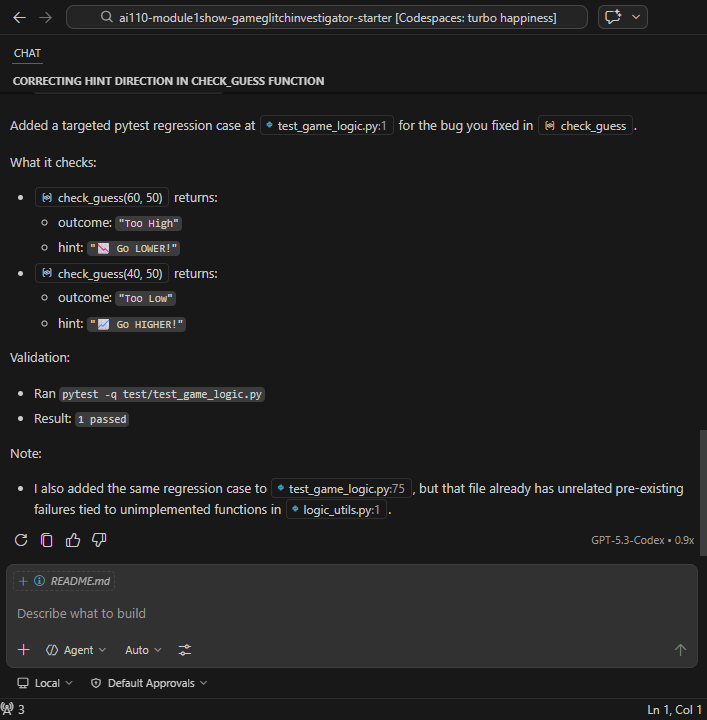
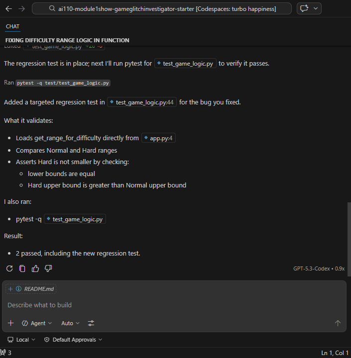
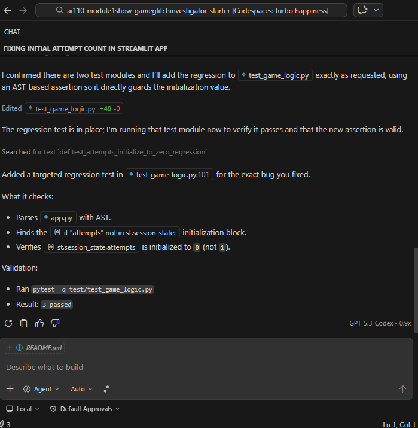
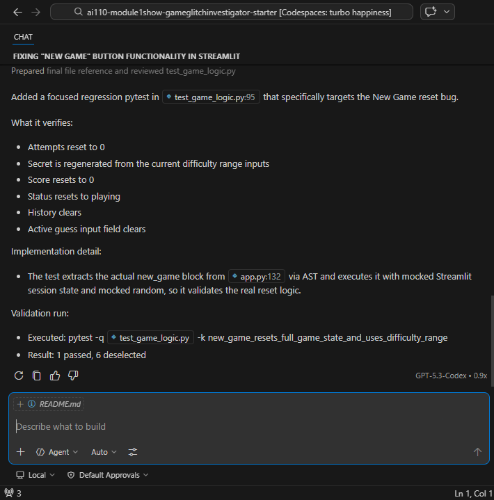
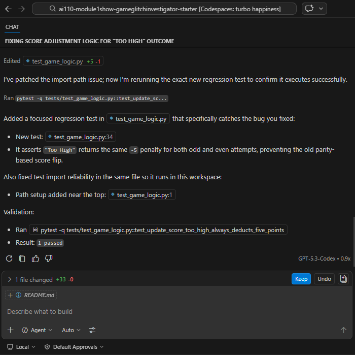
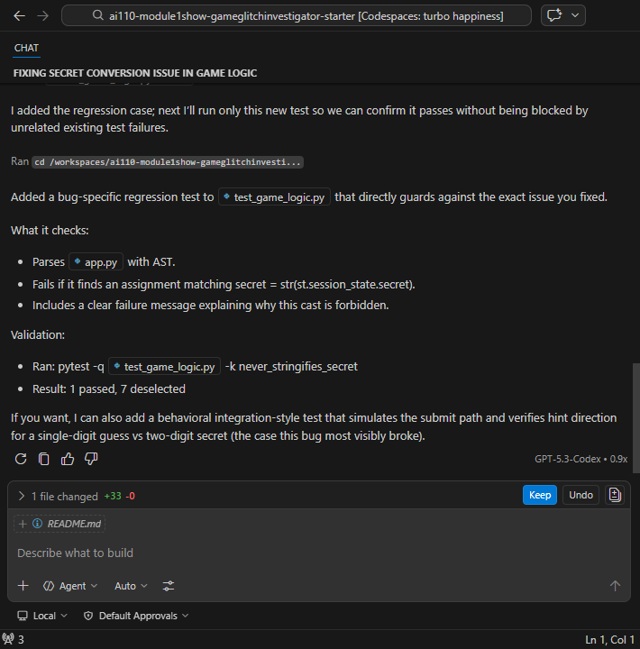
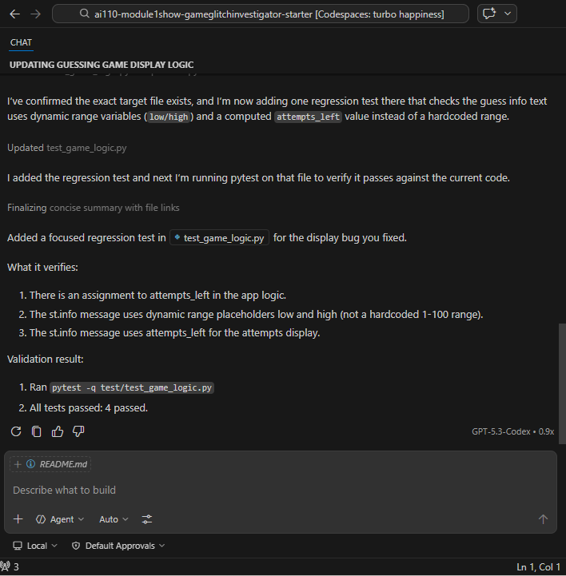
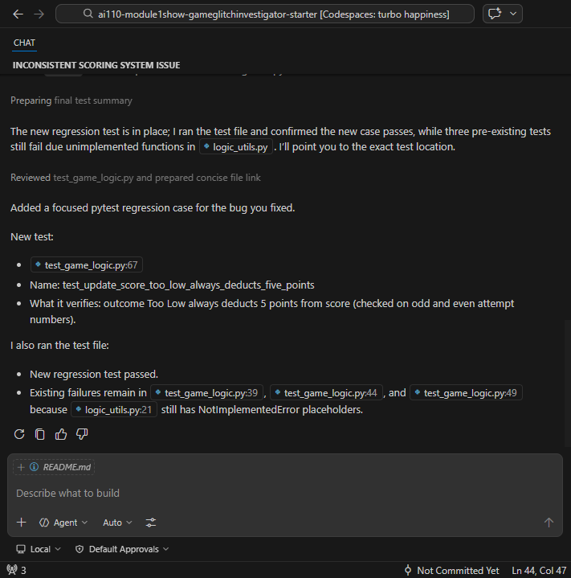

# 🎮 Game Glitch Investigator: The Impossible Guesser

## 🚨 The Situation

You asked an AI to build a simple "Number Guessing Game" using Streamlit.
It wrote the code, ran away, and now the game is unplayable. 

- You can't win.
- The hints lie to you.
- The secret number seems to have commitment issues.

## 🛠️ Setup

1. Install dependencies: `pip install -r requirements.txt`
2. Run the broken app: `python -m streamlit run app.py`

## 🕵️‍♂️ Your Mission

1. **Play the game.** Open the "Developer Debug Info" tab in the app to see the secret number. Try to win.
2. **Find the State Bug.** Why does the secret number change every time you click "Submit"? Ask ChatGPT: *"How do I keep a variable from resetting in Streamlit when I click a button?"*
3. **Fix the Logic.** The hints ("Higher/Lower") are wrong. Fix them.
4. **Refactor & Test.** - Move the logic into `logic_utils.py`.
   - Run `pytest` in your terminal.
   - Keep fixing until all tests pass!

## 📝 Document Your Experience

- [x] Describe the game's purpose.

The game is a number guessing game where the player selects a difficulty and tries to guess a randomly generated number within a limited number of attempts while receiving hints.

- [x] Detail which bugs you found.

The main bugs were reversed hints, the secret number sometimes being converted to a string, the attempt counter starting incorrectly, guesses outside the range being allowed, and the new game button not resetting the game properly.

- [x] Explain what fixes you applied.

I corrected the hint logic, kept the secret number as an integer, started attempts at 0, added range validation for guesses, and updated the new game function to reset the game state correctly with AI assistance.

## 📸 Demo

- [x] [Insert a screenshot of your fixed, winning game here]

- [x] [Insert screenshots of pytests]

## 🚀 Stretch Features

- [ ] [If you choose to complete Challenge 4, insert a screenshot of your Enhanced Game UI here]
